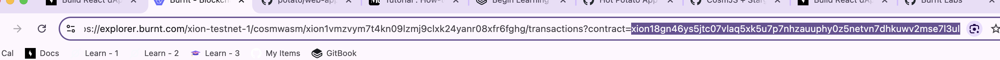

# potato 🥔

## Writing and Deploying an NFT contract on Xion Chain
1. Clone the repo
2. build and deploy the sample contract (`./cw721_contract_sample`) -- optional
    ```
      RES=$(xiond tx wasm store PATH_TO_ARTIFACT \
          --chain-id xion-local-testnet-1 \
          --gas-adjustment 1.3 \
          --gas-prices 0uxion \
          --gas auto \
          -y --output json \
          --chain-id xion-testnet-1 \
          --node https://rpc.xion-testnet-1.burnt.com:443 \
          --from test)
    ```

    ```
    $ echo $RES

    {"height":"0","txhash":"E8A2AE9D4532FCDAF4F841F7EB5AB86AC1291C0B3CCCA9699B78983185993842","codespace":"","code":0,"data":"","raw_log":"","logs":[],"info":"","gas_wanted":"0","gas_used":"0","tx":null,"timestamp":"","events":[]}
    ```
3. Get CODE_ID (From the explorer)
    ```
    CODE_ID=1203
    ```
4. instantiate the contract
     ```
    MSG='{
      "name": "Potato NFT",
      "symbol": "POTATO",
      "minter": "xion1vmzvym7t4kn09lzmj9clxk24yanr08xfr6fghg"
    }'
   ```
   ```
      xiond tx wasm instantiate $CODE_ID "$MSG" \
        --from test --label "potato nft" --gas-prices 0.025uxion --gas auto --gas-adjustment 1.3 -y --no-admin --chain-id xion-testnet-1 --node https://rpc.xion-testnet-1.burnt.com:443
   ```

   output:
   ```
    gas estimate: 234829
    code: 0
    codespace: ""
    data: ""
    events: []
    gas_used: "0"
    gas_wanted: "0"
    height: "0"
    info: ""
    logs: []
    raw_log: ""
    timestamp: ""
    tx: null
    txhash: 6CFC3BD40E5C644CDEF034D296FB41FCB26BD841B917F18E0F02B1005752C2F5
   ```
5. Get contract address: from the explorer
   
6. Save contract address in `src/utils/constants.ts`
7. 